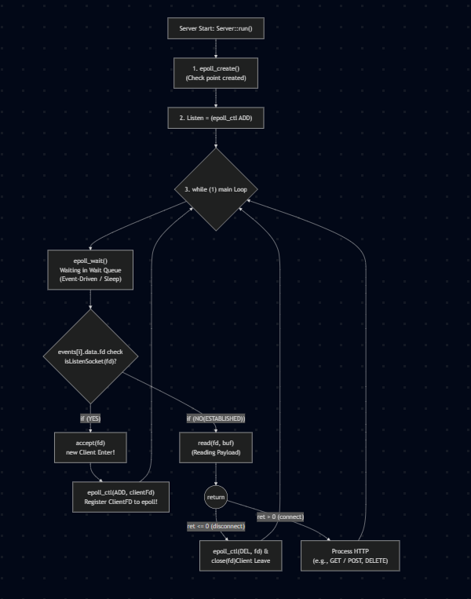

# Server

## overall acrhitecture.

The Server is built on an "event-driven, non-blocking I/O multiplexing" using `epoll`.
- **I/O Multiplexing**: Allows a single thread and single process to monitor and manage multiple socket connections simultaneously without getting blocked.  
## Phase 1.  
### 1. Read the parsed `ServerConfigs`  
### 2. create ListenSocket binding with host:port.  
### 3. store listenSocket.

## Phase 2.
Central controller holding server Configs, listening Sockets, and handling connections with clients.  
- **epoll** : managing I/O events, kind of a checkpoint.  
### 1. checkpoint creating.(epoll_create).

### 2. checkpoint setting how clients passing through that checkpoint(epoll_ctl).  
### 3. checkpoint running(epoll_wait).  

## Event Handling.

### 1. New Client Arrives.
- `accept()`: Accepts the incoming TCP connection and creates `clientFd`.
- `fcntl()`: Sets `clientFd` to `O_NONBLOCK` so read/write operations never freeze the server.
- `epoll_ctl()`: Registers `clientFd` to `epoll` with `EPOLLIN` to listen for incoming HTTP request data.

### 2. Client Sends & Request Data.(`EPOLLIN`)  
- `read()`: Reads incoming raw HTTP request bytes into a buffer.
- **Handle Disconnection / Error (`read <= 0`)**: If the client closes connection (`0`) or an error occurs (`-1`), remove fd from epoll with `epoll_ctl(EPOLL_CTL_DEL)` and clean up the client.
- `appendRequestBuffer()`: Accumulates chunks of data into the client's buffer.
- **Parse Request**: Check if the HTTP header end delimiter (`\r\n\r\n`) and full body are received.
- `epoll_ctl(EPOLL_CTL_MOD)`: Switch event from `EPOLLIN` to `EPOLLOUT` to tell epoll we are ready to send the HTTP response.  
### 3. Server Sends Response Data (`EPOLLOUT`)
- `send()`: Transmits the generated HTTP response from `responseBuffer` to the client.
- **Finish / Clean up**:
  - If finished and no `keep-alive`: remove fd from epoll (`EPOLL_CTL_DEL`), close socket, and erase client.
  - If `keep-alive`: clear buffers and switch back to `EPOLLIN` with `epoll_ctl(EPOLL_CTL_MOD)` for the next request.

