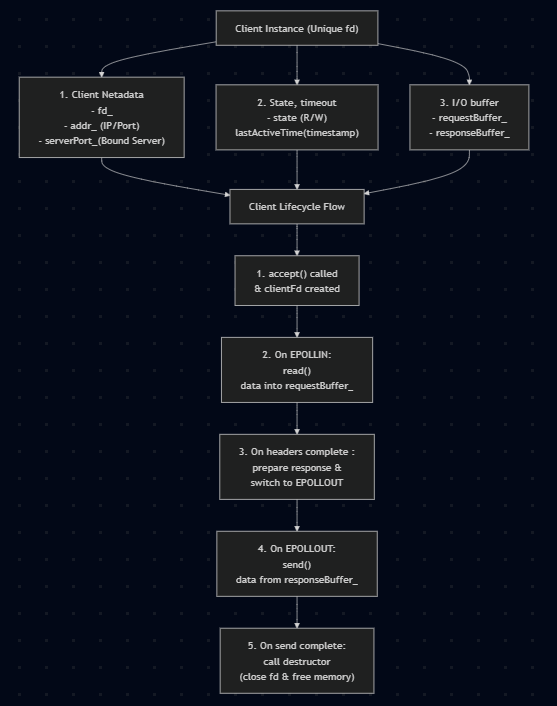

# Client.

  
: The Client class stores all the private data (buffers, socket fd, state) for one single user connection so that multiple clients' data never get mixed up in our single-threaded server.  

The Reality of TCP: TCP is a stream. A client’s HTTP request rarely arrives all in one piece.  
`One read() is NEVER guaranteed to be a full HTTP request.`  
Client A might send 50 bytes, then Client B sends 100 bytes, then Client A sends the remaining 20 bytes.

Why Client is Important: Each Client instance keeps its own requestBuffer_ so the server can piece together chunks across multiple epoll wakeups without mixing up different clients.

## ClientState enum Class
- To check the state of the client.
- READING_REQUEST : read() data read() data into requestBuffer_ until header (\r\n\r\n).
- WRITING_RESPONSE : write() data into client->getResponseBuffer().
- FINISHED : client->getResponseBuffer().empty()

## Timeout Tracking

1. **`lastActiveTime_`**:
   - Stores the timestamp (`time_t`) of when the client connection was created or last performed I/O operations.  

2. **`updateLastActiveTime()`**:
   - Automatically refreshes the timestamp to the current time (`std::time(nullptr)`) whenever incoming data is buffered (`appendRequestBuffer`) or response data is sent (`appendResponseBuffer`/`setResponseBuffer`).  

3. **`getLastActiveTime()`**:
   - Allows the `Server` loop to inspect the timestamp and determine if `currentTime - lastActiveTime_ > TIMEOUT`, triggering a graceful disconnect of inactive clients.

