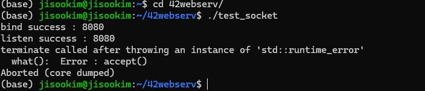
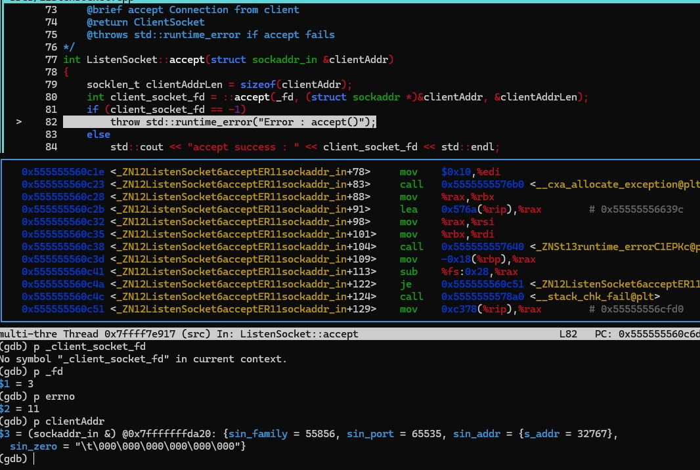

1. Because listening socket is in non-blocking mode, accept() returns -1 and sets errno to EAGAIN or EWOULDBLOCK if there are no pending connections.
    - errno : 11 (EAGAIN or EWOULDBLOCK)
        - there's no client requests in non-blocking mode so try it again

### Screenshots

